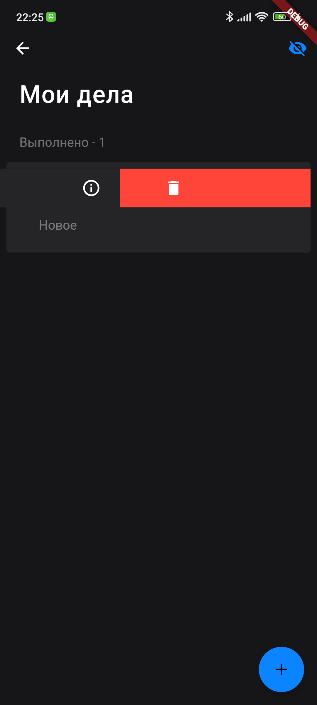

# README

Это проект на Flutter, представляющий собой приложение для управления задачами. Ниже приведены функциональность и инструкции по запуску проекта.

## Функциональность

Этот проект предлагает следующую функциональность:

1. Создание, редактирование и удаление задач.
2. Сохранение задач на диске для последующего использования, с возможностью восстановления после перезапуска приложения.
3. Использование sqflite для обеспечения сохранения задач на диске.
4. Использование библиотеки freezed для создания иммутабельных объектов и кодогенерации.
5. Использование get_it для обеспечения инъекции зависимостей.
6. Использование provider для управления состоянием приложения.

Если у вас есть предложения или замечания по улучшению проекта, пожалуйста, создайте issue в репозитории или свяжитесь со мной напрямую, telegram: Лиза (LizzzaD) - [@LizzzaD](https://t.me/LizzzaD)

## Настройка

1. Клонируйте репозиторий проекта на ваш компьютер с помощью следующей команды:

   ```shell
   git clone https://github.com/LizzzaD/yandex_todo
   ```

2. Перейдите в директорию проекта:

   ```shell
   cd yandex_todo
   ```

3. Установите зависимости проекта, выполнив следующую команду:

   ```shell
   flutter pub get
   ```

4. Сгенерируйте необходимые файлы с помощью `build_runner`, выполните следующую команду:

   ```shell
   dart run build_runner build --delete-conflicting-outputs
   ```

## Запуск проекта

После завершения настройки вы можете запустить проект Flutter с помощью следующей команды:

```shell
flutter run
```

Эта команда запустит приложение на подключенном устройстве или эмуляторе.

## Скриншоты

Ниже представлены скриншоты приложения:

<div style="display:flex;justify-content:center">
    
    
    
</div>

## Загрузка

Вы также можете загрузить готовую собранную версию приложения для установки на устройство Android. Нажмите на ссылку ниже, чтобы скачать APK-файл:

[Скачать приложение](https://github.com/LizzzaD/yandex_todo/releases/download/1.0.0/yandex_todo.apk)

После скачивания APK-файла, установите его на устройстве Android и запустите приложение.
